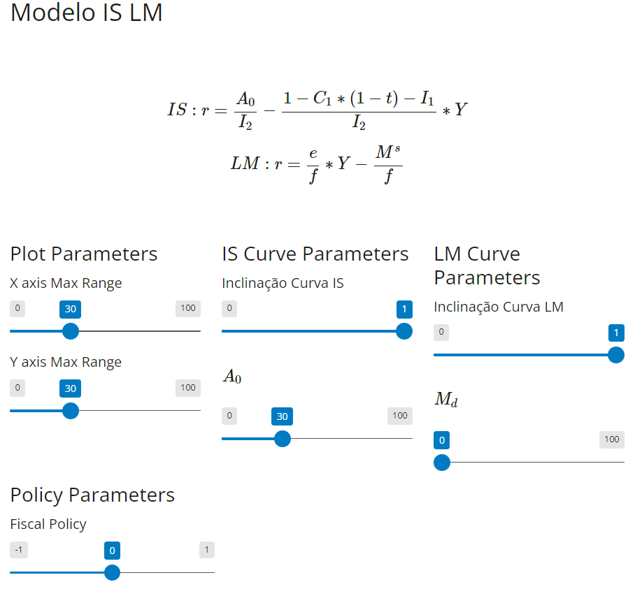

## Modelo IS-LM Simples

Nesse aplicativo simulamos um pequeno modelo IS-LM de porte bem simples, podemos mudar alguns parametros que normalmente são modificados quando nos tratamos nos cursos de macro economia, como interceptos e inclinações de cada uma das curvas.

O principal objetivo do aplicativo é simularmos diferentes cenários de politicas econômicas. O aplicativo terá melhorias para abarcar impacto de inclinação das curvas em breve.

</a>

Abaixo a descrição do Modelo IS-LM:

### Curva IS
Primeiro partimos da equação fundamental do produto
$$ Y = C + I+G$$
Depois descrevemos como cada componente do produto é formado
$$ C = C_{0} + C_{1}*Y_{d} $$
$$ Y_{d} = Y - t*Y $$
$$ I = I_{0} + I_{1}*Y - I_{2}*r $$
$$ G = G_{0} $$
Temos que o Consumo representado por $C$ tem um a parte autonoma, representada por $C_{0}$ e uma que varia de acordo com a propensão ao consumo $C_{1}$ $\in$ $[0,1]$

A renda disponível é descrita como a renda disponível para consumo ou seja, a renda líquida após o pagamento dos impostos e portanto varia de acordo com a renda e de acordo com os impostos sendo $t$ $\in$ $[0,1]$.

Os investimentos possuem seu componente autônomo denotado por $I_{0}$, e também tem dependência positiva da renda e negativa da taxa de juros, denotado pelos parâmetros $I_{1}$ e $I_{2}$ respectivamente.

Os gastos do governo são denotados por $G_{0}$ e são determinados de forma exógenas não sofrendo influência direta do nível de renda e taxa de juros, e na maioria dos casos serão o principal instrumento de política econômica no modelo.

Juntando todas as equações temos : 

$$ Y = C_{0} + C_{1}*(Y - t*Y) + I_{0} + I_{1}*Y - I_{2}*r + G_{0} $$  
Isolando $Y$ e abrindo a equação de consumo:
 $$ Y = ( C_{0} + I_{0} + G_{0} ) + C_{1}*(1-t)*Y + I_{1}*Y - I_{2}*r $$
$$ I_{2}*r = ( C_{0} + I_{0} + G_{0} ) + (C_{1}-1)*(1-t)*Y + I_{1}*Y $$
Para simplificação das equações colocaremos $A_{0} = C_{0} + I_{0} + G_{0}$.
$$ I_{2}*r = A_{0} - ((1-C_{1})*(1-t) + I_{1})*Y $$

Assim por fim chegamos a curva  $IS$:
$$ r = \frac{ A_{0} }{ I_{2} } - \frac{ (1-C_{1})*(1-t) + I_{1} }{ I_{2} }*Y $$

### Curva LM

$$ M^{s} = e*Y - f*r $$

A curva LM em termos estruturais, talvez seja mais simples de explicar do que a formulação da IS. Aqui possuimos apenas uma equação que iguala a oferta  de Moeda as caracteristicas da demanda.

A demanda por moeda varia positivamente em relação a renda e negativamente em relação a taxa de juros.

Para chegarmos a Curva $LM$ isolamos a taxa de juros $r$ em função da renda $Y$:

$$ r = \frac{e}{f}*Y - \frac{ M^{s} }{ f } $$

### Resolução do Modelo

Para a resolução do modelo basta igualar as equações $IS$ e $LM$, para simplificação podemos resumi-las de uma forma que fiquemos com menos parametros, sendo a curva $IS$ uma linear decrescente e a $LM$ uma linear crescente.
$$ IS : r = a - b*Y$$
$$ LM : r = c + d*Y $$
Assim:
$$ a-b*Y = c + d*Y$$
$$ a - c = (b + d)*Y $$
$$ Y = \frac{ a-c }{ b + d} $$
Logo é só substituirmos em uma das equações, outra alternativa é montar um sistema com as duas equações.
### Instrumentos de Politica Econômica

Essencialmente dentro dos modelos mais simplificados temos dois principais instrumentos de política:
1. A politica Físcal, que essencialmente se trata da expansão ou contração de $G_{0}$.
2. A politica Monetaria, é essencialmente a expansão/contração da oferta de moeda dada por $M^{s}$.

Matriz de resultados  das politicas Econômicas

|        |                |                   | $\textbf{Monetaria}$      |                            |
|--------|----------------|-------------------|----------------|----------------------------|
|        |                | $\textbf{Contracionista}$    | $\textbf{Estavel}$        | $\textbf{Expancionista}$              |
|        | $\textbf{Contracionista}$ | $\downarrow Y$, $r$ inconclusivo        | $\downarrow Y$, $\downarrow r$     | $Y$ inconclusivo, $\downarrow r$               |
| $\textbf{Fiscal}$ | $\textbf{Estavel}$        | $\downarrow Y$, $\uparrow r$| Neutra         | $\uparrow Y$, $\downarrow r$            |
|        | $\textbf{Expancionista}$  | $Y$ inconclusivo, $\uparrow r$     | $\uparrow Y$, $\uparrow r$  | $\uparrow Y$, $r$ inconclusivo |

### Parametros de Politica economica - App

Para o aplicativo temos alguns instrumentos de polica que podem ser aplicados, como por exemplo as politicas fiscais expancionistas e contracionistas e o mesmo pode ser feito para o caso das politicas economicas monetárias.

Podemos também aplicar uma mudança na inclinação nas curvas $IS$ e $LM$, por hora a inclinação é alterada de forma *bruta*, assim os parametros $C_{1}, t, I_{1}, I_{2}, e $ e $f$ não estão disponíveis para alteração, mas em um futuro próximo estarão.

Para que isso não afete negativamente no enunciado vamos dar uma olhada em como cada um dos parâmetros afeta suas respectivas curvas. Existe um outro aplicativo que nos permite estressar o impacto de cada um dos parametros da curva $IS$ e $LM$ sobre suas inclinações.

#### Curva IS

| Parâmetro   | Efeito |
| ---------   | -------|
| $C_{1}$     |        |
| $t$         |        |
| $I_{1}$     |        |
| $I_{2}$     |        |

#### Curva LM

| Parâmetro   | Efeito |
| ---------   | -------|
| $e$         |        |
| $f$         |        |

